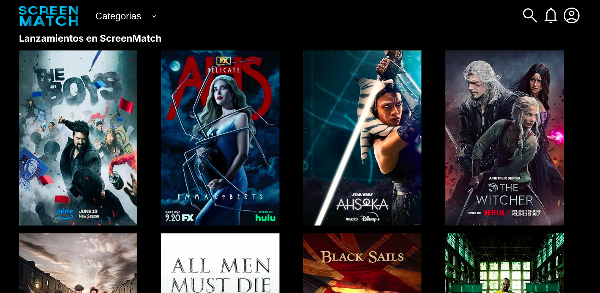
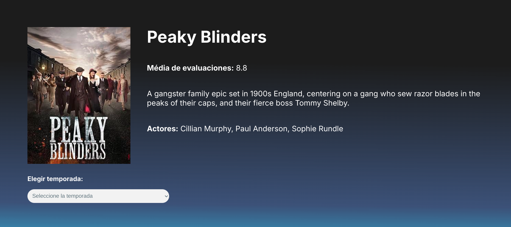
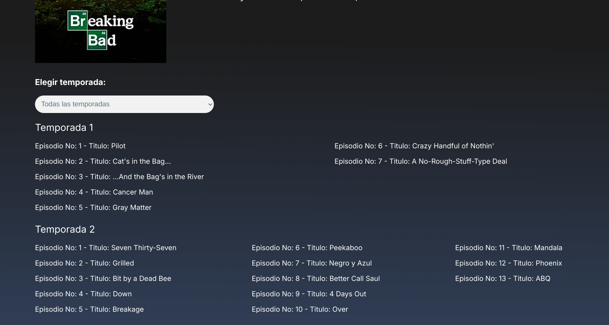
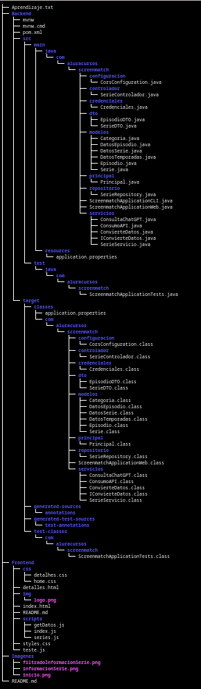

# ScreenMatch

- Pagina principal:

## Descripción:
Esta es una aplicación web diseñada para permitir a los usuarios 
ver, buscar y gestionar contenido multimedia, como películas y 
series. Los usuarios pueden interactuar con la aplicación a través
de una interfaz gráfica intuitiva o mediante su API.

La aplicación fue desarrollada en Java con Spring framework 
y emplea PostgreSQL como base de datos.

En este proyecto, se hizo un énfasis especial en las buenas 
prácticas de programación, incluyendo:

### Programación Orientada a Objetos (POO): 
Para asegurar un código modular y reutilizable.

### Programación Funcional: 
Para mejorar la legibilidad y mantener un código más limpio y 
eficiente.

### Patrón de Diseño MVC (Modelo-Vista-Controlador): 
Para separar la lógica de negocio, la interfaz de usuario y la 
entrada del usuario.

### Arquitectura de APIs RESTful: 
Para garantizar que la aplicación sea escalable, fácil de mantener
y que permita una comunicación eficiente entre los componentes 
del sistema.

El objetivo del proyecto era desarrollar una aplicación web 
robusta utilizando Java y el framework Spring, y crear una 
API RESTful siguiendo las mejores prácticas de programación.

Este proyecto forma parte de la especialización en Backend con 
Java y Spring framework del programa ONE (Oracle Next Education).
  

- Informacion general de una serie:

## Funcionalidades de la Aplicación:

La aplicación ofrece una variedad de funcionalidades diseñadas para
mejorar la experiencia del usuario al interactuar con el contenido
multimedia. Entre las principales funcionalidades se incluyen:

### Visualizar todos los títulos disponibles: 
Los usuarios pueden explorar la biblioteca completa de películas y 
series disponibles en la plataforma.

### Ver los títulos más populares: 
Acceso a una lista de los contenidos más vistos y mejor valorados
por la comunidad.

### Ver los últimos lanzamientos: 
Actualizaciones constantes con los 
títulos más recientes añadidos a la plataforma.

### Ver la información general de una serie: 
Detalles sobre cada serie, incluyendo sinopsis, reparto, género
y más.

### Ver todos los episodios por temporada: 
Navegar a través de los episodios de una serie organizados por
temporada.

### Filtrar episodios por temporada: 
Filtrar y seleccionar episodios específicos dentro de una 
temporada de una serie.

### Ver el top 5 de los mejores episodios de una serie: 
Acceder a una lista de los episodios mejor valorados de cada serie.

### Buscar títulos por categoría: 
Función de búsqueda avanzada que permite encontrar películas y 
series según su categoría o género.

Estas funcionalidades están diseñadas para proporcionar una 
experiencia de usuario personalizada, permitiendo a los 
usuarios descubrir y disfrutar del contenido de manera
eficiente.  

- Informacion de las temporadas de una serie:

## Tecnologias y herramientas utilizadas para desarrollar este proyecto:

1. Java como lenguaje de programacion.
2. Spring Boot para la creacion de aplicaciones web con Java.
3. Spring Data Para trabajar con bases de datos.
4. Maven como gestor de dependencias.
5. Libreria Jackson para serializar y deserializar datos JSON.
6. API de OMDb para obtener los datos de las series.
7. API de chatGPT para traducir la sinopsis de cada titulo(Solo disponible con la version de pago).
8. PostMan para realizar pruebas con solicitudes HTTP.
9. PostgreSQL como base de datos.
10. Git y GitHub para el control de versiones.
  

- Estructura del proyecto:

